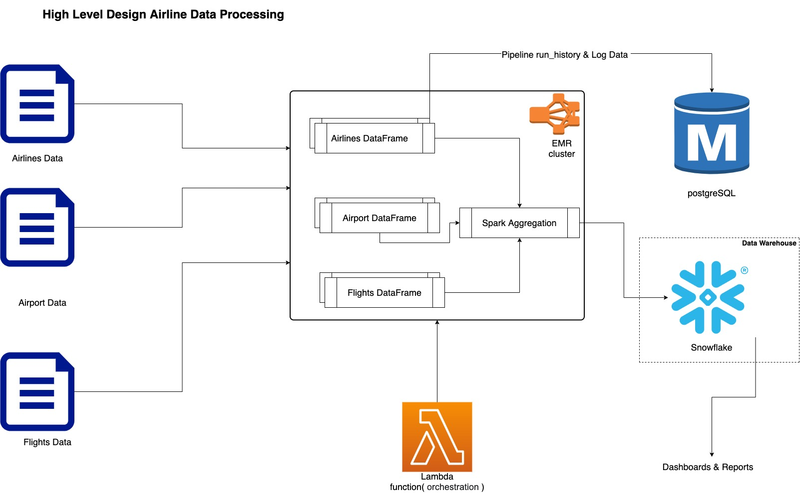

# airline-data-pipeline
This repository will be used for data ingestion & processing of airline-data 

-----
# Data Files
    
    For data files please refer /resources/data folder

-----
## High Level Design

-----

# Requirements

    JDK 1.7 or higher
    maven
    Scala 2.12.12
    Spark 3.1.1
    PostgreSQL 10 
    snowflake
    Databricks
    *AWS Lambda
    *AWS EMR

    * If we want to run the job on AWS EMR Using AWS Lambda.
----

# Build

    *** Change your /resources/pipeline_config.json entries 
    according to your configuration ***

    Go to project root dir
    > mvn clean install -U

------

# Snowfalke warehouse/schema/Table Creation

    Please refer script/database/snowflake.sql
    
    create or replace warehouse INTERVIEW_WH warehouse_size=X-Small initially_suspended=true;
    create transient database USER_ASUTOSH;

    USE WAREHOUSE INTERVIEW_WH;
    USE USER_ASUTOSH;

    create schema "USER_ASUTOSH"."CURATED";
    GRANT SELECT ON ALL TABLES IN SCHEMA "CURATED" TO ROLE PUBLIC;
    
    CREATE TABLE "USER_ASUTOSH"."CURATED"."AIRLINE_AGGREGATED" ("YEAR" INTEGER, "MONTH" INTEGER, "DAY" INTEGER, 
    "DAY_OF_WEEK" INTEGER, "FLIGHT_NUMBER" INTEGER, "TAIL_NUMBER" STRING, "ORIGIN_AIRPORT" STRING, "DESTINATION_AIRPORT" STRING,
    "SCHEDULED_DEPARTURE" INTEGER, "DEPARTURE_TIME" INTEGER, "DEPARTURE_DELAY" INTEGER, "TAXI_OUT" INTEGER, "WHEELS_OFF" INTEGER, 
    "SCHEDULED_TIME" INTEGER, "ELAPSED_TIME" INTEGER, "AIR_TIME" INTEGER, "DISTANCE" INTEGER, "WHEELS_ON" INTEGER, "TAXI_IN" INTEGER,
    "SCHEDULED_ARRIVAL" INTEGER, "ARRIVAL_TIME" INTEGER, "ARRIVAL_DELAY" INTEGER, "DIVERTED" INTEGER, "CANCELLED" INTEGER, 
    "CANCELLATION_REASON" STRING, "AIR_SYSTEM_DELAY" INTEGER, "SECURITY_DELAY" INTEGER, "AIRLINE_DELAY" INTEGER, "LATE_AIRCRAFT_DELAY" INTEGER, 
    "WEATHER_DELAY" INTEGER, "EVENT_DATE" DATE, "AIRLINE_NAME" STRING, "TOTAL_DELAY" INTEGER, "ORIGIN_AIRPORT_NAME" STRING,
    "DESTINATION_AIRPORT_NAME" STRING, "ORIGIN_AIRPORT_CITY" STRING, "DESTINATION_AIRPORT_CITY" STRING, "ORIGIN_AIRPORT_STATE" STRING,
    "DESTINATION_AIRPORT_STATE" STRING, "ORIGIN_AIRPORT_COUNTRY" STRING, "DESTINATION_AIRPORT_COUNTRY" STRING, "ORIGIN_AIRPORT_LATITUDE" STRING, 
    "DESTINATION_AIRPORT_LATITUDE" STRING, "ORIGIN_AIRPORT_LONGITUDE" STRING, "DESTINATION_AIRPORT_LONGITUDE" STRING);

------

# Run On Datbricks

    Please refer script/notebook/airline.scala & script/notebook/airline.html
    
    1. Login to Datbricks, create a cluster.
    2. Craete a New Notebook and copy the conetnt of script/notebook/airline.scala to notebook.
        * Before to this step snowfalke warehouse/schema/Table creation must have been created.
    3. Attach the Notebook to cluster and run cell.

------

# Run On EMR

    1. Configure script/lambda/airline_data_lambda.py with propper
        
        "spark.driver.cores": "2",
        "spark.executor.cores": "2",
        "spark.driver.memory": "13G",
        "spark.executor.memory": "13G",
        "spark.driver.memoryOverhead": "1460M",
        "spark.executor.memoryOverhead": "1460M",
        "spark.executor.instances": "10",
        "spark.default.parallelism": "50"
        
    2. Create a new AWS Lambda script taking the script from airline_data_lambda.py.(If we need to schedule this job we can use cloud watch events)
    
    3. Then copy the whole code base to s3://bucket/key/ location. Update the same path in lambda
    
    4. Launch the cluster through lambda.

------

# Run On Local

    For dry run call AirLineDataController with "DEV" OR "PROD" as runtime parameter.

------

# Postgres Table Creation

    Please refer script/database/postgres.sql

    create table if not exists pipeline_run_history(
    ID SERIAL PRIMARY KEY,
    ETL_NAME VARCHAR(60) NOT NULL,
    SKIP_EXECUTION CHAR(1) NOT NULL,
    FULL_LOAD CHAR(1) NOT NULL,
    IS_ACTIVE CHAR(1) NOT NULL,
    run_date timestamp,
    filter_col1_name VARCHAR(100),
    filter_col1_value  VARCHAR(1000),
    filter_col2_name VARCHAR(100),
    filter_col2_value VARCHAR(1000)
    );
    
    create table if not exists exception_log(
    ID SERIAL PRIMARY KEY,
    ETL_NAME CHAR(60) NOT NULL,
    run_id SERIAL,
    date_time timestamp,
    exception_message text
    );
    
    INSERT INTO pipeline_run_history (ETL_NAME , SKIP_EXECUTION, FULL_LOAD, IS_ACTIVE, run_date, filter_col1_name)
    VALUES ('airline-data', 'N', 'Y', 'Y', current_timestamp, 'EVENT_DATE');

----

